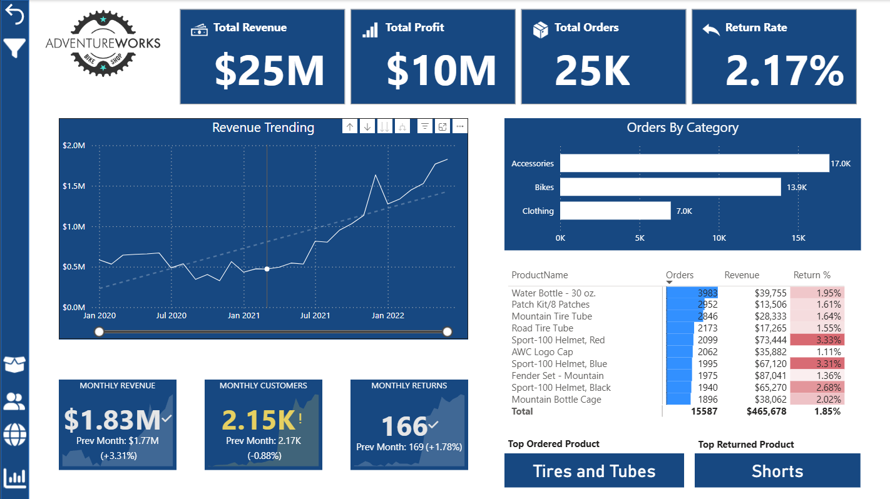
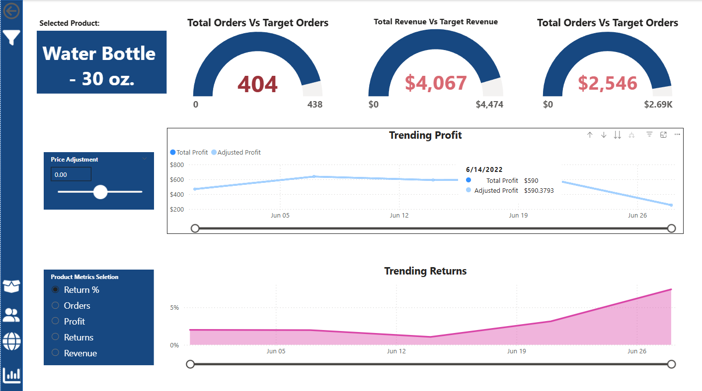
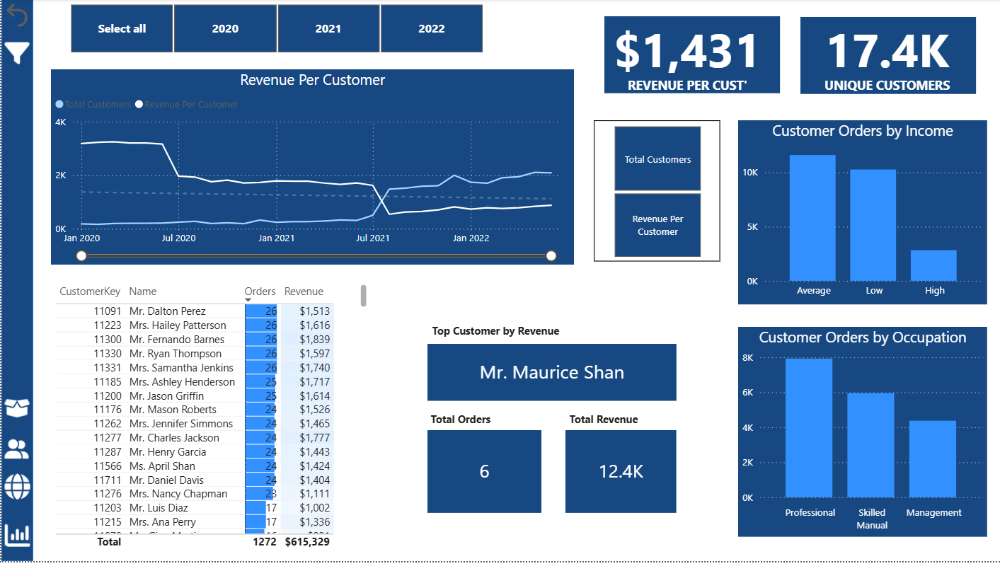
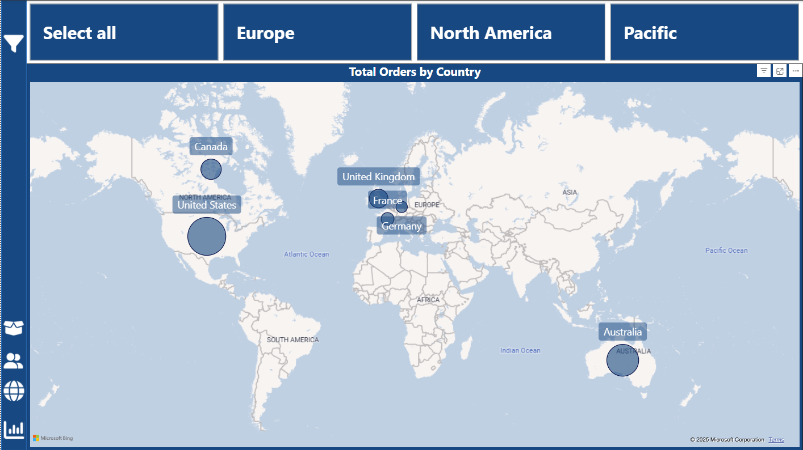

# 🧭 AdventureWorks Business Insights

**Power BI dashboards analyzing sales, customer behavior, and regional performance from the AdventureWorks dataset.**

---

## 📊 Project Overview  
This project explores AdventureWorks sales data (2020–2022) to uncover trends in revenue, profitability, and customer engagement.  
The goal was to design a professional BI report with executive, product, customer, and regional perspectives.

The dataset was imported from **CSV files**, cleaned and transformed using **Power Query**, modeled using a **star schema**, and visualized in **Power BI Desktop**.

---

## 🧠 Key Insights  
- **Revenue & Profit Growth:** Year-over-year measures reveal steady revenue gains through 2022.  
- **Customer Trends:** Revenue per customer and order volume vary significantly by income and occupation.  
- **Product Insights:** Accessories drive the highest volume, while bikes contribute the most profit.  
- **Regional Analysis:** North America dominates total orders, followed by Europe and the Pacific region.  
- **Return Rate Analysis:** Maintained below 4%, indicating healthy customer satisfaction.

---

## 🧩 Data Model  
The data model follows a **star schema** for optimized reporting and DAX efficiency:  
- **Fact Tables:** Sales Data, Returns Data  
- **Dimension Tables:** Calendar, Customer, Product, Subcategory, Category, Territory  

---

## 📈 Dashboards  

### 🧾 Executive Dashboard  
- KPIs for Revenue, Profit, Orders, and Return Rate  
- Month-over-Month & Year-over-Year trends  

---

### 🧰 Product Dashboard  
- Compare product performance vs targets  
- Simulate profit adjustments via dynamic price slider  

---

### 👥 Customer Dashboard  
- Analyze customer orders by income and occupation  
- Identify top-performing customers by revenue  

---

### 🌍 Regional Dashboard  
- Global view of total orders by country and region  
- Highlight top-performing sales territories  

---

## ⚙️ Tools Used  
- **Power BI Desktop** — Data modeling, DAX, and visualization  
- **Power Query** — ETL for data cleaning and transformation  
- **Excel / CSV** — Data source format  
- **GitHub + OneDrive** — Version control and cloud storage  

---

## 🚀 Next Steps  
- Add automated refresh via Power BI Service (Pro account)  
- Integrate forecasting using DAX time intelligence  
- Create a video walkthrough for portfolio presentation  

---

## 👋 Author  
**Axel Rodriguez**  
📧 [Your Email or LinkedIn Link Here]  
💼 [LinkedIn Profile](https://www.linkedin.com/) | 🧠 [Portfolio / Website if available]

